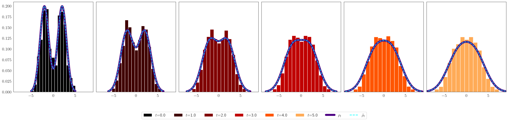

# Iterated Schrödinger Bridge Approximation to Wasserstein Gradient Flows


This repository contains code and simulations results for the paper [**Iterated Schrödinger Bridge Approximation to Wasserstein Gradient Flows**](https://arxiv.org/abs/2406.10823). The code implements our Schrödinger Bridge (SB) scheme for discrete approximation of heat flow. The SB iterations can be computed for any set of initial particles using the functions `entropy_SB_scheme_sinkhorn` and `entropy_SB_scheme_mcmc` from the script `SB_scheme_Entropy.py`.


## Background

When the set of intial particles are independently and identically distributed realizations from a Gaussian distribution, the true gradient flow is available analytically. The SB update is written as a pushforward involving barycentric projection with respect to the Schrödinbger bridge with equal marginals. For Gaussian starting measure, all subsequent SB updates are Gaussian distributed. Since the Schrodinger bridge is explicitly available for Gaussian marginals [(Janati et al. (2020))](https://proceedings.neurips.cc/paper/2020/hash/766e428d1e232bbdd58664b41346196c-Abstract.html), we can explicitly compute the SB step. 

We compare the SB update to the true gradient flow. We also push a finite number of particles using the barycentric projections and illustrate how they provide a discretized sample approximation of the true gradient flow. To compute the SB step, the discrete Schrodinger bridge is approximated using the celebrated Sinkhorn algirthm or an MCMC based method [(Harchaoui et al. (2020))](https://projecteuclid.org/journals/bernoulli/volume-30/issue-3/Asymptotics-of-discrete-Schr%c3%b6dinger-bridges-via-chaos-decomposition/10.3150/23-BEJ1659.full). The comparison between these approaches is considered in `SB_approx.ipynb`. The detailed mathematical setup and algorithm for computing trhe sample approximation of the SB steps is described in `simulations.pdf`.

Consider $500$ i.i.d. observations from a mixture of two Gaussians. We approximate the discretized heat flow starting from this distribution by pushing the particles using the SB scheme with a regularization parameter $\varepsilon = 0.1$. Histograms of these particles is plotted below at every 1 time unit. Let $\rho(t)$ be the gradient flow and $\hat \rho(t)$ be the piecewise-constant interpolation of the SB scheme. Both $\rho(t)$ and $\hat \rho(t)$ are also plotted. The histogram provides a finite sample approximation of $\hat \rho(t)$.




## Dependencies

The following conda environment can be built to run the code. The environment uses Python version 3.12.
```
conda env create -f environment.yml
conda activate gradient_flows
```

## Reproducing Experimental Results

If we have $n$ i.i.d. observations from any starting distribution $\rho_0$, we use SB scheme to obtain a discrete approximation of the heat flow starting from $\rho_0$ by running the following code. Replace `X` by an array-like object of initial particles.

```
from SB_scheme_Entropy import entropy_SB_scheme_sinkhorn
X = np.random.normal(size=(500,))
entropy_SB_scheme_sinkhorn(X, steps=[1, 100], eps=0.01, precision=1e-8)
```
The functional arguments are
- `X`: All particles sampled from the initial distribution.
- `steps`: List of time steps at which to record the state of the particles.
- `eps`: regularization parameter for the Sinkhorn algorithm.
- `precision`: precision for the Sinkhorn algorithm convergence.

To reproduce the results for the Gaussian family starting measures, one can run

```
python SB_scheme_entropy.py --SB_estimation_method <SB_estimation_method> --source_dist <source_dist> --time <time> --step_size <step_size> --n_particles <n_particles>
```
where 
- `<time>` is the duration of heat flow to approximate
- `<step_size>` is the regularization parameter of the Schrödinger bridge
- `<n_particles>` is the number of initial particles
The options for the remaining arguments are
- `<SB_estimation_method>`: `sinkhorn`, `mcmc`
- `<source_dist>`: `gaussian`, `gaussian_mix`, `thin_gaussian`

#### Notebooks

- The results for all experiments are visualized in `SB_scheme_Entropy.ipynb`.
- The two methods for approximating the discrete Schrödinger bridge are compared in `SB_approx.ipynb`.

## Citation

If you find this implementation useful, please cite:

```
@article{agarwal2024iterated,
  title={Iterated Schr$\backslash$" odinger bridge approximation to Wasserstein Gradient Flows},
  author={Agarwal, Medha and Harchaoui, Zaid and Mulcahy, Garrett and Pal, Soumik},
  journal={arXiv preprint arXiv:2406.10823},
  year={2024}
}
```


